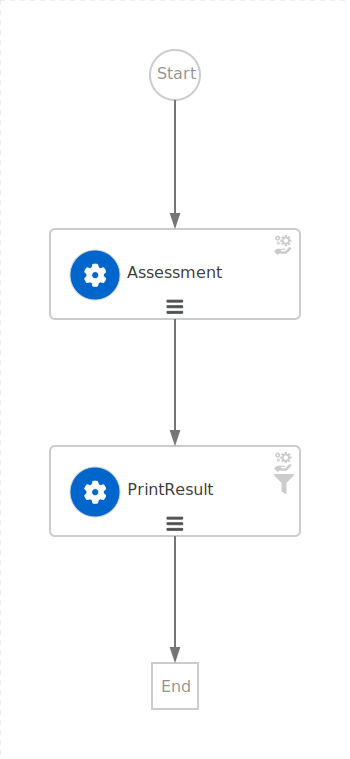

# Basic assessment workflow
A basic assessment workflow that evaluates a repository and returns infrastructure workflow options with their id and name.

For simplicity's sake, the workflow assesses whether the repository URL contains the keyword `java` or not to recommend available infrastructure workflows.

**Note**:
This example assumed that the workflow options returned upon assessment are available and known by the assessment task developer.
The list of workflows provided into `resources/infrastructures` are purely illustrative.

## Assessment flow


## How to run

```bash
mvn clean quarkus:dev
```

Example of POST to trigger the flow:
```bash
curl -XPOST -H "Content-Type: application/json" http://localhost:8080/assessment -d '{"repositoryUrl": "_YOUR_JAVA_REPOSITORY_"}'
```

Response:
```
{
    "id": "c9a0ce80-8cd2-49d2-81e1-05606e52c9c9",
    "workflowdata": {
        "workflowOptions": {
            "currentVersion": {
                "id": "ocpOnbarding",
                "name": "Ocp Onboarding"
            },
            "upgradeOptions": [],
            "migrationOptions": [
                {
                    "id": "move2kube",
                    "name": "Move2Kube"
                }
            ],
            "newOptions": [
                {
                    "id": "vmOnboarding",
                    "name": "Vm Onboarding"
                }
            ],
            "continuationOptions": [],
            "otherOptions": [
                {
                    "id": "training",
                    "name": "Training"
                }
            ]
        }
    }
}
```