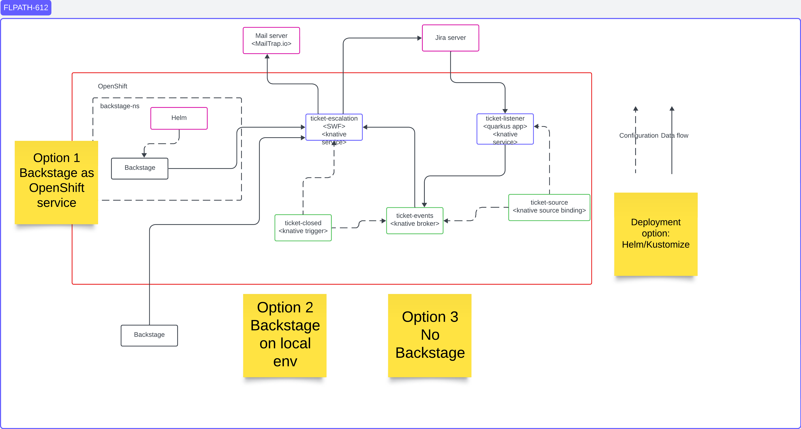

# Escalation workflow with Event Driven Architecture
**WORK IN PROGRESS**

## Use case
As a user I want to create a ticket to request the creation of a new namespace in an OpenShift cluster and inform the given
escalation manager in case the ticket is not completed in a given time.

Working assumptions:
* Jira is the ticketing system
* The escalation manager is notified with an email from an external mailing service
* The application is deployed as a serverless workload in OpenShift using Helm charts
* The user workflow is implemented using the SonataFlow platform

## Architectural components


## Jira server
A ticketing service configured to create tickets and notify webhooks any time the tickets are updated.

# Escalation workflow
A Serverless Workflow receiving the user request and then creating the ticket: once it is approved, it take care of provisioning the given namespace.
** WORK IN PROGRESS ***

### Jira listener
A Java application configured to receive webhooks from the ticketing service, extract the relevant data and notify the Escalation workflow about the approval.

See the [README](./jira-listener/README.md)

### Serverless infrastructure
It is made of the following components:
* `Red Hat Serverless Operator`, and basic `KnativeEventing` and `KnativeServing` instances
* An in-memory `Broker` receiving `CloudEvent`s from the `Jira listener` (linked using a  `SinkBinding` instance) to the `Escalation workflow` 
  (using a `Trigger` instance)

## Deploying the example
**WORK IN PROGRESS**

This is a two steps deployment:
1. Deploy the serverless infrastrucure (optional, if already availble)
2. Deploy the escalation services

### eda-infra chart
The [eda-infra](./helm/eda-infra/Chart.yaml) Helm creates the `Red Hat Serverless Operator`, and default instances of `KnativeEventing` and `KnativeServing`.
This chart requires a user with `cluster-admin` role.

**Note**: as an alternative, you can provision the same resources manually, using the OpenShift UI console or the `oc` CLI command.

It also created the needed [CRDs](./helm/eda-infra/crds/operator.yaml) according to the latest release of the
[OpenShift Serverless 1.30 operator](https://access.redhat.com/documentation/en-us/red_hat_openshift_serverless/1.30/html-single/about_serverless/index#new-features-1-30-0_serverless-release-notes).

CRDs have been downloaded as:
```bash
curl -LJO https://github.com/knative/operator/releases/download/knative-v1.9.6/operator.yaml
```

The following commands install, upgrade and delete the [eda-infra](./helm/eda-infra/Chart.yaml) Helm chart in the `default` namespace with name `eda-infra`:
```bash
helm install -n default eda-infra helm/eda-infra --debug
helm upgrade -n default eda-infra helm/eda-infra --debug
helm uninstall -n default eda-infra --debug
```

After the initial installation, run the following commands to wait until the serverless infrastructure is ready:
```bash
> oc wait -n knative-eventing knativeeventing/knative-eventing --for=condition=Ready --timeout=5m          
knativeeventing.operator.knative.dev/knative-eventing condition met
> oc wait -n knative-serving knativeserving/knative-serving --for=condition=Ready --timeout=5m
knativeserving.operator.knative.dev/knative-serving condition met
```

**Note**: the CRDs are not removed when the chart is uninstalled, see the [Helm docs](https://helm.sh/docs/chart_best_practices/custom_resource_definitions/#some-caveats-and-explanations)
**Know issues**: after the uninstall command the KnativeEventing and KnativeServing instances can remain in terminating state, which also prevents the 
associated namespaces from being deleted. Manually run this command to verify the status:
```bash
oc get knativeeventing,knativeserving --all-namespaces
```
Then run this command to patch the instances so that they can be eventually deleted:
```bash
oc patch -n knative-eventing knativeeventing/knative-eventing -p '{"metadata":{"finalizers":null}}' --type=merge
oc patch -n knative-serving knativeserving/knative-serving -p '{"metadata":{"finalizers":null}}' --type=merge
```

### escalation-eda chart
**WORK IN PROGRESS**

The [escalation-eda](./helm/escalation-eda/Chart.yaml) Helm creates all the services related to the deployment of the `Escalation workflow` and the `Jira listener`.
This chart requires a user with `admin` role.

Helm properties:

| Property | Description | Default |
|----------|-------------|---------|
| `namespace` | Target namespace | `escalation` |
| `jiralistener.image` | Container image of the `Jira listener` application | `quay.io/dmartino/jira-listener-jvm` |
| `eventdisplay.enabled` | Flag to install the optional `event-display` application for debugging purposes | `true` |

The following commands install, upgrade and delete the [escalation-eda](./helm/escalation-eda/Chart.yaml) Helm chart in the `default` namespace
 with name `escalation-eda`:
```bash
helm install -n default escalation-eda helm/escalation-eda --debug
helm upgrade -n default escalation-eda helm/escalation-eda --debug
helm uninstall -n default escalation-eda --debug
```

After the initial installation, run the following commands to wait until the serverless infrastructure is ready:
```bash
> oc wait -n escalation ksvc/jira-listener --for=condition=Ready --timeout=5m
service.serving.knative.dev/jira-listener condition met
```


