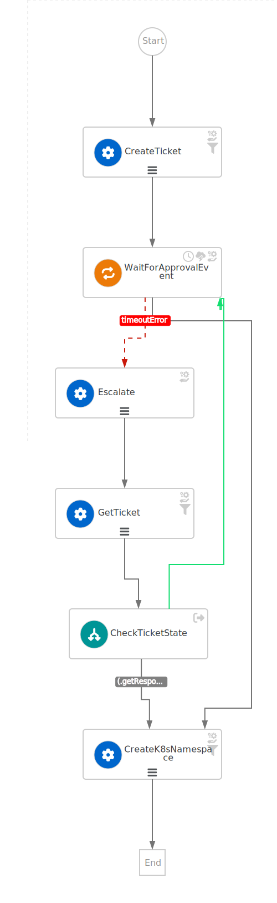
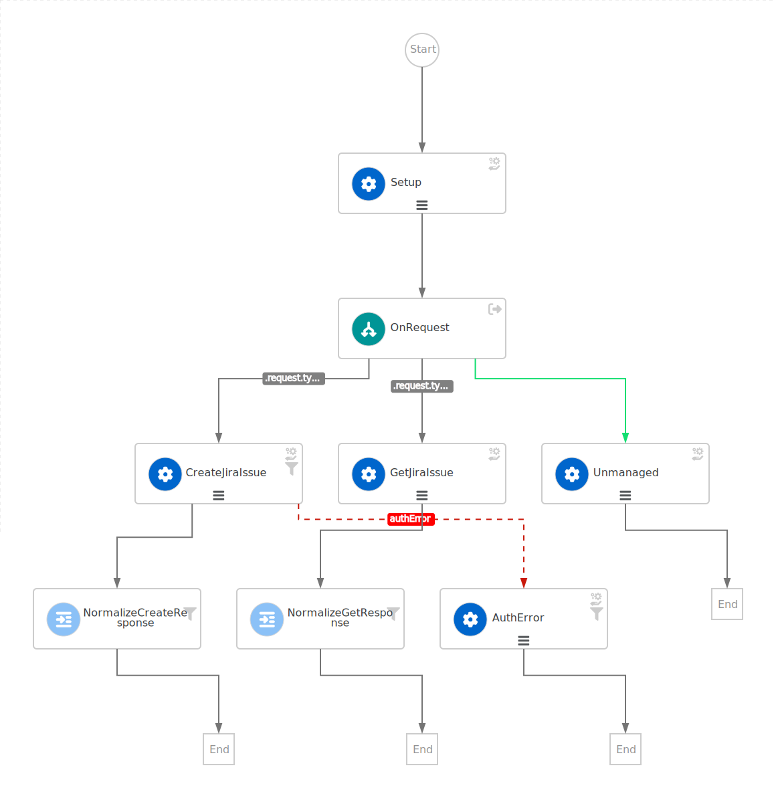

# Event Driven Escalation workflow
An escalation workflow integrated with a pluggable `Ticketing Service` orchestrated by 
[SonataFlow](https://sonataflow.org/serverlessworkflow/latest/index.html)
and built on Event Driven Architecture (EDA).

The initial implementation of the `Ticketing Service` is using [Atlassian JIRA](https://www.atlassian.com/software/jira).

Email service is using [MailTrap Send email API](https://api-docs.mailtrap.io/docs/mailtrap-api-docs/bcf61cdc1547e-send-email-early-access).

## Prerequisites
* Access to a Jira server (URL, user and [API token](https://support.atlassian.com/atlassian-account/docs/manage-api-tokens-for-your-atlassian-account/))
* [in-cluster deployment only] Access to an OpenShift cluster with `admin` Role
* An account to [MailTrap](https://mailtrap.io/home) with a [testing Inbox](https://mailtrap.io/inboxes) and an [API token](https://mailtrap.io/api-tokens)
* Available or Running [Janus IDP Backstage Notification Service](https://github.com/janus-idp/backstage-plugins/tree/4d4cb781ca9fc331a2c621583e9203f9e4585ee7), please note the following:
  * This readme is made with Janus IDP version merged after Notification plugin's [PR #933](https://github.com/janus-idp/backstage-plugins/pull/933)
  ```shell
    git clone https://github.com/janus-idp/backstage-plugins.git
    git checkout 4d4cb781ca9fc331a2c621583e9203f9e4585ee7
    cd <your project directory>/backstage-plugins
  ```
  * Follow the [Notification Backend Plugin Readme](https://github.com/mareklibra/janus-idp-backstage-plugins/tree/c3ff659a0a2a9fba97b9e520568c93da09f150ae/plugins/notifications-backend) to configure the plugin and run.
  ```shell
      yarn start:backstage
  ```
  * After Janus IDP successfully starts, be sure the following create notification command (as given in Notification Plugin Backend readme) works without errors 
  ```shell
    curl -X POST http://localhost:7007/api/notifications/notifications -H "Content-Type: application/json" -H "notifications-secret: <Replace_this_with_your_shared_secret>" -d '{"title":"my-title","origin":"my-origin","message":"message one","topic":"my-topic"}'
    ```

## Escalation flow
The main escalation workflow is defined by the [ticketEscalation](./src/main/resources/ticketEscalation.sw.yaml) model:
* Create a ticket using the configured `Ticketing Service` subflow
* Wait until the `approvalEvent` is received
  * If the waiting time exceeds the configured timeout, the error with `code: TimedOut` is handled to run the `Escalate` actions `SendNotification` and
  `SendEmail` to send the warning notification and/or email
  to the escalation manager
  * To ensure that an event coming during the escalation state is not lost, the `GetTicket` and `CheckTicketState` states are executed before returning
  to the waiting state
* Only when the event is received or the current status is `Approved` the workflow is transisioned to the final state `CreateK8sNamespace`



The generalized implementation delegates all the `Ticketing Service` requests (e.g., `CreateTicket` and `GetTicket`) to a subflow whose requirements are:
* The `id` must be `ticketingService`
* It must be packaged together with the main workflow
* The workflow data input must comply with the schema defined in [specs/subflow-input-schema.json](./src/main/resources/specs/subflow-input-schema.json), e.g. the subflow accepts a generic request with a `type` field that defines the kind of requests and
returns a well-defined response:
```yaml
# Create request 
request:
  type: create
  namespace: "<the namespace name>"
  parentId: "<the parent workflow ID that must be part of the approval event>"

# Expected response
type: create
ticketId: "<internal ticket ID used to fetch the status>"
ticket: "<original JSON document>"
browseUrl: "<URL to broswe the ticket>"
```
```yaml
# Get request 
request:
type: \"\", ticketId: .createResponse.ticketId, ticket: .createResponse.ticket} }"  
  type: get
  ticketId: "<the ticketId returned from the create request>"
  ticket: "<the ticket returned from the create request>"

# Expected response
type: get
ticketId: "<internal ticket ID used to fetch the status>"
ticket: "<original JSON document>"
status: "<one of: Created, Approved, Unknown>"
```

The sample implementation using the Atlassian JIRA service is defined by the following diagram:


**Note about the Jira implementation**: The value of the `.jiraIssue.fields.status.statusCategory.key` field is the one to be used to identify when the `done` status is reached, all the other
similar fields are subject to translation to the configured language and cannot be used for a consistent check.

### Dependencies on latest SonataFlow artifacts
* This implementation is dependent on version `999-SNAPSHOT` of the SonataFlow platform artifacts as you can see in the [pom.xml](./pom.xml)..
```xml
<kogito.bom.version>999-SNAPSHOT</kogito.bom.version>
```

In order to build and execute the workflows, a specific reference to the `JBoss Public Repository Group` has beeen added, 
following the instructions documented [here](https://openshift-knative.github.io/docs/docs/latest/serverless-logic/getting-started/create-your-first-workflow-service.html#proc-configuring-maven-rhbq).

**These changes allow to build and run the workflow but do not contain the required fixes to manage the timeout error. 
Expect some runtime issues**

This section will be removed once the latest artifacts are finally released.

## Application configuration
Application properties can be initialized from environment variables before running the application.

### Ticket escalation properties
| Environment variable  | Description                                                                                                    | Mandatory | Default value                              |
|-----------------------|----------------------------------------------------------------------------------------------------------------|-----------|--------------------------------------------|
| `BACKSTAGE_NOTIFICATIONS_URL`        | The Backstage Notification Service URL                                                                         | ✅ | `http://localhost:7007/api/notifications/` |
| `MAILTRAP_URL`        | The MailTrail API Token                                                                                        | ❌ | `https://sandbox.api.mailtrap.io`          |
| `MAILTRAP_API_TOKEN`  | The MailTrail API Token                                                                                        | ✅ |                                            |
| `MAILTRAP_INBOX_ID`   | The ID of the MailTrap inbox                                                                                   | ✅ |                                            |
| `MAILTRAP_SENDER_EMAIL` | The email address of the mail sender                                                                           | ❌ | `escalation@company.com`                   |
| `OCP_API_SERVER_URL`  | The OpensShift API Server URL                                                                                  | ✅ |                                            |
| `OCP_API_SERVER_TOKEN`| The OpensShift API Server Token                                                                                | ✅ |                                            |
| `ESCALATION_TIMEOUT_SECONDS` | The ISO 8601 duration format to wait before triggering the escalation request, after the issue has been created | ❌ | `PT60S`                                    |

### Jira Ticketing Service properties

| Environment variable  | Description | Mandatory | Default value |
|-----------------------|-------------|-----------|---------------|
| `JIRA_URL`            | The Jira server URL | ✅ | |
| `JIRA_USERNAME`       | The Jira server username | ✅ | |
| `JIRA_API_TOKEN`      | The Jira API Token | ✅ | |
| `JIRA_PROJECT`        | The key of the Jira project where the escalation issue is created | ❌ | `TEST` |
| `JIRA_ISSUE_TYPE`     | The ID of the Jira issue type to be created | ✅ | |
| `JIRA_WORKFLOW_INSTANCE_ID_LABEL` | The name part of the Jira ticket label that contains the ID of the related SWF instance (e.g. `workflowInstanceId=123`)  | ❌ | `workflowInstanceId` |
| `JIRA_WORKFLOW_NAME_LABEL` | The whole Jira ticket label that contains the name of the SWF (e.g. `workflowName=escalation`) | ❌ | `workflowName=escalation` |


## How to run
You can run it locally as a Quarkus application or using the deployment instructions at [escalation-eda chart chart](../README.md#escalation-eda-chart):
```bash
mvn -Dquarkus.profile=jira clean quarkus:dev
```

**Note**: The `jira` profile is selected in the above command to run the provided properties in [application-jira.properties](./src/main/resources/application-jira.properties)

Initialize the environment before running some test command.

For local runtime:
```bash
ESCALATION_SWF_URL="http://localhost:8080"
```
Otherwise, in case of Knative environment:
```bash
ESCALATION_SWF_URL=$(oc get ksvc -n escalation escalation-swf -oyaml | yq '.status.url')
ESCALATION_SWF_URL="${ESCALATION_SWF_URL//\"/}"
```

Or, in case of regular deployment:
```bash
ESCALATION_SWF_URL=$(oc get route -n escalation escalation-swf -oyaml | yq '.status.ingress[0].host')
ESCALATION_SWF_URL="${ESCALATION_SWF_URL//\"/}"
```

Example of POST to trigger the flow (see input schema in [ticket-escalation-schema.json](./src/main/resources/specs/ticket-escalation-schema.json)):
```bash
export NAMESPACE=new-namespace
export MANAGER=manager@company.com
envsubst < input.json > data.json
SWF_INSTANCE_ID=$(curl -k -XPOST -H "Content-Type: application/json" "${ESCALATION_SWF_URL}/ticketEscalation" -d @data.json | jq '.id')
SWF_INSTANCE_ID="${SWF_INSTANCE_ID//\"/}"
echo $SWF_INSTANCE_ID
```

Where [input.json](./input.json) defines the input document as:
```json
{
  "namespace": "${NAMESPACE}",
  "email": {
    "manager": "${MANAGER}"
  }
}
```
To resume the pending instance, send a CloudEvent with:

```bash
curl -k -X POST -H "Content-Type: application/cloudevents+json" -d "{ \
  \"specversion\": \"1.0\", \
  \"type\": \"dev.parodos.escalation\", \
  \"source\": \"jira.listener\", \
  \"id\": \"123456\", \
  \"time\": \"2023-10-10T12:00:00Z\", \
  \"kogitoprocrefid\": \"$SWF_INSTANCE_ID\", \
  \"data\": { \
    \"ticketId\": \"ES-6\", \
    \"workFlowInstanceId\":\"$SWF_INSTANCE_ID\", \
    \"workflowName\": \"escalation\", \
    \"status\": \"done\" \
    } \
  }" ${ESCALATION_SWF_URL}
```
Tips:
* Visit [Workflow Instances](http://localhost:8080/q/dev/org.kie.kogito.kogito-quarkus-serverless-workflow-devui/workflowInstances)
* Visit (Data Index Query Service)[http://localhost:8080/q/graphql-ui/]

## Building the containerized image
The application runs from a containerized image already avaliable as `quay.io/orchestrator/escalation-swf:1.0`.
You can build and publish your own image using:
```bash
mvn clean install -Pknative
docker tag quay.io/orchestrator/escalation-swf:1.0 quay.io/_YOUR_QUAY_ID_/jira-listener-jvm
docker push quay.io/_YOUR_QUAY_ID_/escalation-swf:1.0
```

## Open Items
* Move the subflow to a separate folder and package the selected `Ticketing Service` implementation at deployment time
* Error handling:
  * Define errors in the expected reponses
  * Catch errors in the main workflow
* Prepare a non-Jira implementation
  * Detailed dev guide of next implementations
* Restore disabled UT
* When in-cluster, connect the workflow to the deployed postgresql, data-index and jobs-service instead og the embedded services
