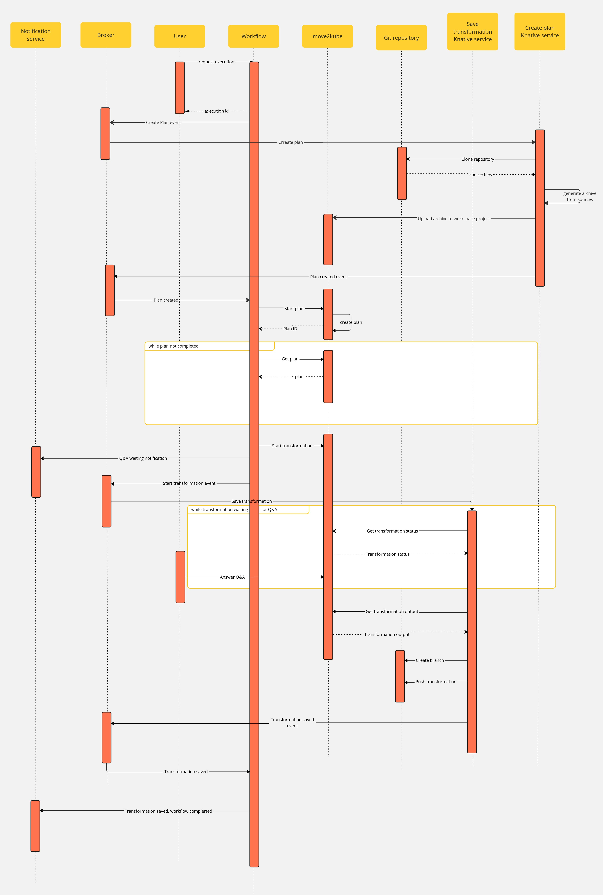
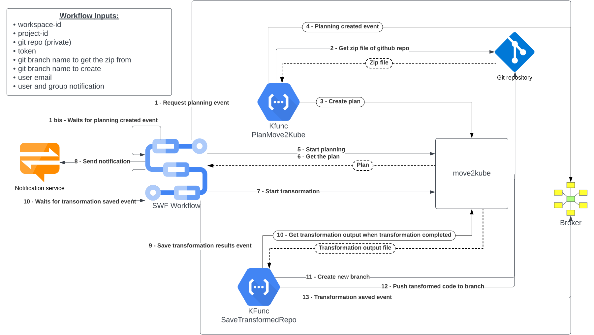
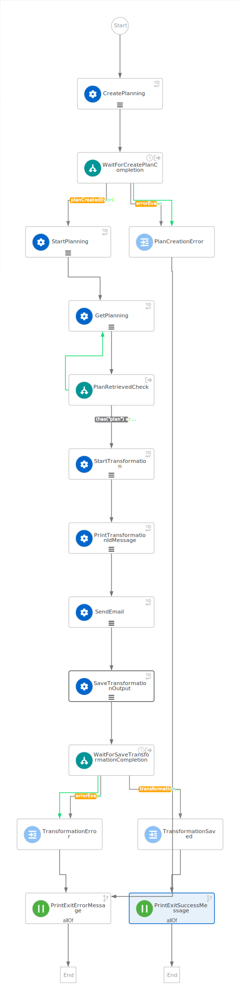

# m2k Project
Google doc version: https://docs.google.com/document/d/1lN8KT5u9vYag4N2DBg3a_G0bKarunM4k5d-CmX2GzNk/edit
## Context
This workflow is using https://move2kube.konveyor.io/ to migrate the existing code contained in a git repository to a K8s/OCP platform.

Once the transformation is over, move2kube provides a zip file containing the transformed repo.

### Design diagram



### Workflow

## Install
### Data Index and Jobs Service
Follow the [README.md](..%2Fdeployment%2Fkustomize%2FREADME.md)

## Breakdown
1. (prequisites) Create local K8s cluster with Knative support: https://knative.dev/docs/install/quickstart-install/#install-the-knative-cli
2. Install Move2Kube on local K8s cluster: https://artifacthub.io/packages/helm/move2kube/move2kube/0.3.0?modal=install
3. Run Backstage with notification plugin
4. Deploy generated files: Knative broker, triggers and sonataflow workflow service
4. Deploy Knative functions

### Deploy
First, let's create our namespace
```bash
kubectl create ns m2k
```
Should output
```
namespace/m2k created
```

#### 1. Move2Kube
move2kube needs to have the ssh keys in the `.ssh` folder in order to be able to clone git repository using ssh:
```bash
kubectl create secret generic sshkeys --from-file=id_rsa=${HOME}/.ssh/id_rsa --from-file=id_rsa.pub=${HOME}/.ssh/id_rsa.pub
```
To run properly, a move2kube instance must be running in the cluster, or at least reachable from the cluster:
```bash
kubectl apply -f k8s/move2kube.yaml
```
Should output
```
deployment.apps/move2kube created
service/move2kube-svc created
```

You can access it locally with port-forward:
```bash
kubectl port-forward  svc/move2kube-svc 8080:8080 &
```

By default, the Knative function will use `http://move2kube-svc.default.svc.cluster.local:8080/api/v1` as host to reach the move2kube instance.
You can override this value by setting environment variable `MOVE2KUBE_API`
#### 2. Backstage with notification plugin
The workflow is sending notification to backstage so you need a running instance with the notification plugin.

To do so, clone this repo https://github.com/mareklibra/janus-idp-backstage-plugins and checkout the branch `flpath560`.
Then run
```bash
yarn start:backstage
```
Wait a few minutes for everything to be ready then check if the notification plugin is working:
```bash
curl -XGET http://localhost:7007/api/notifications/notifications&user=<your user>
```
You should get en empty notifications list:
```
[]
```

#### 3. Generated files
First, make sure the environment and minikube are correctly configured to the `knative` profile:
```bash
minikube profile knative
```
Should output
```
✅  minikube profile was successfully set to knative
```
Then
```bash
eval $(minikube docker-env)
```

We need to use `initContainers` in our Knative services, we have to tell Knative to enable that feature:
```bash
  kubectl patch configmap/config-features \
    -n knative-serving \
    --type merge \
    -p '{"data":{kubernetes.podspec-init-containers: "enabled"}}'
  ```

Then generate the `broker` (and other workflow related Knative resources) by running the following command from `m2k/serverless-workflow-m2k`:
```bash
cd serverless-workflow-m2k
mvn clean package -Pknative
```
Now you can apply the generated manifest located in `serverless-workflow-m2k/target/kubernetes` (you should still be in the `serverless-workflow-m2k` directory):

First let's create the Knative service, service account and role bindings needed for the workflow
```bash
kubectl -n m2k apply -f serverless-workflow-m2k/target/kubernetes/knative.yml 
```
Should output
```
Warning: Kubernetes default value is insecure, Knative may default this to secure in a future release: spec.template.spec.containers[0].securityContext.allowPrivilegeEscalation, spec.template.spec.containers[0].securityContext.capabilities, spec.template.spec.containers[0].securityContext.runAsNonRoot, spec.template.spec.containers[0].securityContext.seccompProfile
service.serving.knative.dev/serverless-workflow-m2k created
rolebinding.rbac.authorization.k8s.io/serverless-workflow-m2k-view created
serviceaccount/serverless-workflow-m2k created
```
And then the broker and the triggers
```bash
kubectl -n m2k apply -f serverless-workflow-m2k/target/kubernetes/kogito.yml 
```
Should output
```
trigger.eventing.knative.dev/error-event-type-trigger-serverless-workflow-m2k created
trigger.eventing.knative.dev/transformation-saved-event-type-trigger-serverless-workflow-m2k created
broker.eventing.knative.dev/default created
```

You also need to fill the environment variables needed:

/!\ You may need to change those value, especially the `image` /!\
```bash
kubectl -n m2k patch ksvc serverless-workflow-m2k --type merge -p '{
   "spec":{
      "template":{
         "spec":{
            "containers":[
               {
                  "name":"serverless-workflow-m2k",
                  "imagePullPolicy": "Always",
                  "image":"quay.io/orchestrator/serverless-workflow-m2k:2.0.0-SNAPSHOT",
                  "env":[
                     {
                        "name":"MOVE2KUBE_URL",
                        "value":"http://move2kube-svc.default.svc.cluster.local:8080"
                     },
                     {
                        "name":"BROKER_URL",
                        "value":"http://broker-ingress.knative-eventing.svc.cluster.local/m2k/default"
                     }
                  ]
               }
            ]
         }
      }
   }
}'
```
This will create a new deployment, you need to scale the previous one to 0:
```bash
 kubectl -n m2k scale deployment --replicas=0 serverless-workflow-m2k-00001-deployment 
```

And the docker image shall be generated as well:
```bash
docker images | grep serverless
```
Should output
```
quay.io/orchestrator/serverless-workflow-m2k                                    <none>         cd2e0498ee70   4 minutes ago   487MB
```
#### 4. M2K Knative functions and GC
* [m2k-service.yaml](k8s/m2k-service.yaml) will deploy the Knative service that will spin-up the functions when an event is received
* [m2k-trigger.yaml](k8s/m2k-trigger.yaml) will deploy the triggers related to the expected event and to which the kservice subscribes and rely on to get started
* [knative-gc.yaml](k8s%2Fknative-gc.yaml) will setup the GC to keep only 3 revisions in the cluster

As we are using ssh keys to interact with the git repo (ie: bitbucket), similarly to what we have done when deploying the `move2kube` instance, we need to create secrets in the `m2k` namespace containing the keys:
```bash
kubectl create -n m2k secret generic sshkeys --from-file=id_rsa=${HOME}/.ssh/id_rsa --from-file=id_rsa.pub=${HOME}/.ssh/id_rsa.pub
```
* From the root folder of the project, first create the Knative services:
```bash
kubectl -n m2k apply -f k8s/m2k-service.yaml 
```
Should output
```
service.serving.knative.dev/m2k-save-transformation-func created
```
Next, the Knative Garbage Collector:
```bash
kubectl apply -f k8s/knative-gc.yaml 
```
Should output
```
configmap/config-gc configured
```
Finally the triggers
```bash
kubectl -n m2k apply -f k8s/m2k-trigger.yaml 
```
Should output
```
trigger.eventing.knative.dev/m2k-save-transformation-event created
```
You will notice that the environment variable `EXPORTED_FUNC` is set for each Knative service: this variable defines which function is expose in the service.

You should have something similar to:
```bash
kubectl -n m2k get ksvc
```
```
NAME                           URL                                                               LATESTCREATED                     LATESTREADY                       READY   REASON
m2k-save-transformation-func   http://m2k-save-transformation-func.m2k.10.110.165.153.sslip.io   m2k-save-transformation-func-v1   m2k-save-transformation-func-v1   True    
serverless-workflow-m2k        http://serverless-workflow-m2k.m2k.10.110.165.153.sslip.io        serverless-workflow-m2k-00002     serverless-workflow-m2k-00002     True  
```
### Use it
You should be sending the following request from withing the K8s cluster, to do so, you can for instance run:
```bash
kubectl run fedora --rm --image=fedora -i --tty -- bash
```

Request an execution by sending the following request:
```bash
curl -X POST -H 'Content-Type: application/json'  serverless-workflow-m2k.m2k.svc.cluster.local/m2k -d '{
"repo": "https://bitbucket.org/<repo path>", 
"sourceBranch": "master",
"targetBranch": "mk2-swf",
"token": "<optional, bitbucket token with read/write rights, otherwise will use ssh key>",
"workspaceId": "816fea47-84e6-43b4-81c8-9a7462cf9e1e",
"projectId": "fc411095-4b3c-499e-8590-7ac09d89d5fc",
"notification": {
    "user": "<your user>",
    "group": "<your group>"
}
}'
```
Reponse:
```json
{"id":"185fd483-e765-420d-91c6-5ff3fefa0b05","workflowdata":{}}
```
Then you can monitor the Knative functions pods being created:
```bash
Every 2.0s: kubectl -n m2k get pods                                                                                                                                                              fedora: Fri Oct 13 11:33:22 2023

NAME                                                          READY   STATUS    RESTARTS      AGE
m2k-save-transformation-func-v1-deployment-545dc45cfc-rsdls   2/2     Running   0             23s
serverless-workflow-m2k-00002-deployment-58fb774d6c-xxwg2     2/2     Running   0             55s
```

Then you can check your Move2Kube instance and BitBucket repo to see the outcomes.

After ~2min the serverless deployment will be scaled down if there is no activity.

If the workflow was waiting for an event, once the event is triggered and received, the deployment will be scaled up and the workflow will resume its execution at the waiting state, processing the received event.

If the timeout expires while the workflow is down, as the jobs service is sending an event, the deployment will be scaled up and the timeout will be processed.

#### Debug/Tips

* By default, Knative services have a `imagePullPolicy` set to `IfNotPresent`. You can override that by setting `registries-skipping-tag-resolving: quay.io` in the configmap `config-deployment` located in the `knative-serving` namespace
  ```bash
  kubectl patch configmap/config-deployment \
    -n knative-serving \
    --type merge \
    -p '{"data":{"registries-skipping-tag-resolving":"quay.io"}}'
  ```
* You can use the Integration tests `SaveTransformationFunctionIT` to debug the code
* If there is a `SinkBinding` generated you need to patch it as the namespace of the broker is not correctly set:
```bash
kubectl patch SinkBinding/sb-serverless-workflow-m2k \
  -n m2k \
  --type merge \
  -p '{"spec": {"sink": {"ref": {"namespace": "m2k"}}}}'
```
